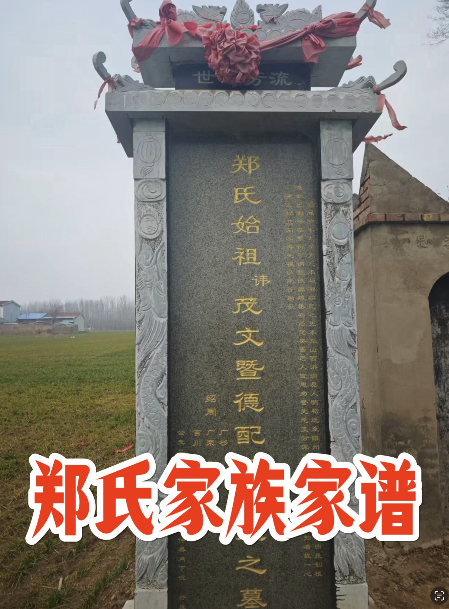
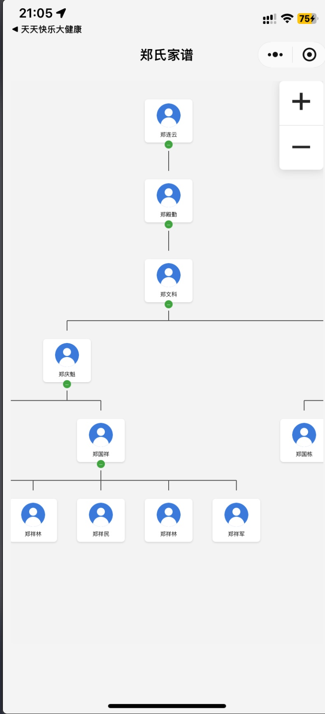

# wechat mini program for family tree

The story behind this program is:

<iframe width="560" height="315" src="https://www.youtube.com/embed/4ZEat7JTvkU?si=TBnYSD16ztyDpfK-" title="YouTube video player" frameborder="0" allow="accelerometer; autoplay; clipboard-write; encrypted-media; gyroscope; picture-in-picture; web-share" referrerpolicy="strict-origin-when-cross-origin" allowfullscreen></iframe>

every chinese new year i back hometown, the older generation will do a ceremony of memorize the dead, (i mean the ones who were dead many decades ago, even before this new country established, like Qing, Ming dynasty， AD 1799... )   anyway, i made this app to quickly find out whom i am bowing down to. also for younger generation who are not familiar with our big family

---

