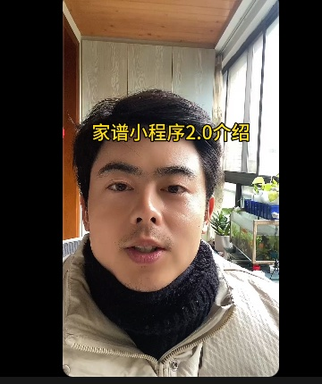

# wechat mini program for family tree

The story behind this program is:

<video id="video" controls="" preload="none" poster="封面">
 <source id="mp4" src="https://www.youtube.com/embed/4ZEat7JTvkU" type="video/mp4">
</videos>  

every chinese new year i back hometown, the older generation will do a ceremony of memorize the dead, (i mean the ones who were dead many decades ago, even before this new country established, like Qing, Ming dynasty， AD 1799... )   anyway, i made this app to quickly find out whom i am bowing down to. also for younger generation who are not familiar with our big family

---

https://www.youtube.com/embed/4ZEat7JTvkU