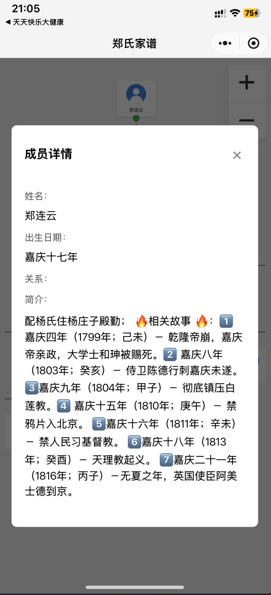

# wechat mini program for family tree

The story behind this program is:

every chinese new year i back hometown, the older generation will do a ceremony of memorize the dead, (i mean the ones who were dead many decades ago, even before this new country established, like Qing, Ming dynasty， AD 1799... )   anyway, i made this app to quickly find out whom i am bowing down to. also for younger generation who are not familiar with our big family

每年农历新年，我回到家乡，老一辈人都会举行纪念死者的仪式，（我指的是几十年前去世的人，甚至在这个新国家建立之前，比如清朝、明朝、公元 1799 年……）无论如何，我制作了这个应用程序来快速找出我在向谁鞠躬。也适用于不熟悉我们大家庭的年轻一代

---

## 首页

## 管理页面 

https://www.youtube.com/embed/4ZEat7JTvkU